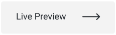

<h1>

Dogs
</h1>
<h2>
This application simulates a social media made for dogs.
</h2>

This application was built with Origamid Dogs API, all photos posted by a user will be automatically deleted after 10 minutes.

 

  

<h2>Default account</h2>

  Login: dog | 
  Password: dog

 

  

<h2>Account</h2>
 

  

<h2>Modal & Photo Page</h2>
 

  

  

## Technologies

This project was developed with the following technologies:

- [ReactJS](https://reactjs.org/)
- [typescript](https://www.typescriptlang.org/)
- [styled-components](https://www.styled-components.com/)
- [react-router-dom](https://reactrouter.com/)
- [victory](https://formidable.com/open-source/victory/)
